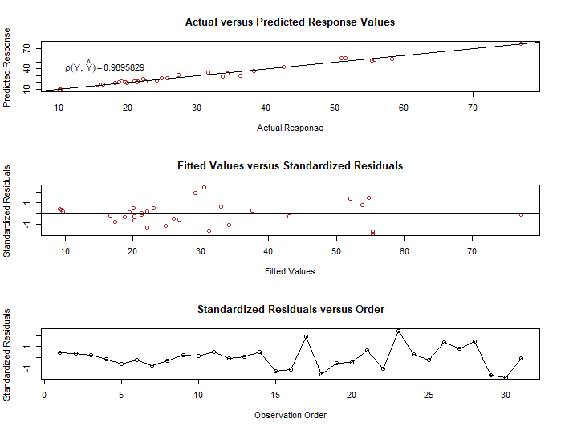
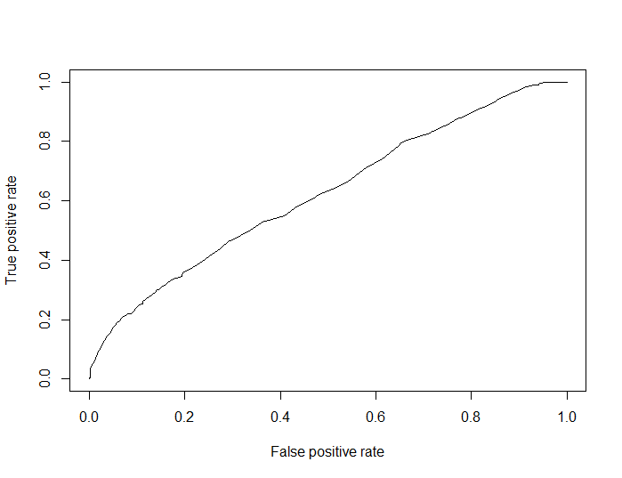

```{r, include = FALSE}
knitr::opts_chunk$set(
  collapse = TRUE,
  comment = "#>"
)
```

This package is designed to construct Conic Multivariate Adaptive Regression 
Splines (CMARS) in R. CMARS model is a linear combination of basis functions 
that is taken from the forward part of the MARS algorithm. CMARS model parameters are obtained after solving Conic Quadratic Programming (CQP) which includes two
cone constraints to handle accuracy and complexity of the model. Please check 
Weber, et al. (2011) CMARS: a new contribution to nonparametric regression with multivariate adaptive regression splines supported by continuous optimization. Inverse Problems in Science and Engineering, 2012, 20.3: 371-400. doi:10.1080/17415977.2011.62477, for more details.

Prediction and binary classification models can be constructed with cmaRs. Note
that **in order to construct CMARS models, both MOSEK software and Rmosek 
package needed. Please follow carefully the steps available in https://docs.mosek.com/latest/rmosek/install-interface.html for successful installation.**


In order to construct CMARS models, a user can define the following arguments

* **formula**: description of the model
* **degree**: maximum degree of interaction
* **nk**: maximum number of model terms before pruning 
* **data**: data frame
* **classification**: binary variable indicating whether the model is for 
prediction or binary classification
* **threshold.class**: the threshold value that is used to convert probabilities
to classes in binary classification models.

```{r setup}
library(cmaRs)
```

This package includes three data sets; preddata.std, classdata.std and table.b6.
The first two data sets are taken from UCI: Machine
Learning Repository (available at http://archive.ics.uci.edu/ml/), preprocessed
and standardized. The first one is used for prediction and the other one is used
for binary classification. Moreover, there is one more data set called as 
table.b6 which is directly taken from the "MPV" package (version 1.58) 
(Braun, and MacQueen, 2023). 

* The preddata.std includes `r nrow(preddata.std)` observations and `r ncol(preddata.std)` variables.

```{r}
data(preddata.std)
head(preddata.std)
```

* The classdata.std includes `r nrow(classdata.std)` observations and `r ncol(classdata.std)` variables.

```{r}
data(classdata.std)
head(classdata.std)
```

* The table.b6 includes `r nrow(table.b6)` observations and `r ncol(table.b6)` variables.

```{r}
data(table.b6)
head(table.b6)
```


# The Prediction Modeling

As an example, the following prediction CMARS model for the data set trees can 
be constructed with the following snippets.

```{r echo=TRUE,  results='hide', eval=FALSE}
prediction.model <-  cmaRs(Volume ~ ., degree = 2, nk = 20, data = trees)
```
In order to study this model in detail, the **summary** function can be used. 
Note here that the CMARS model is determined with **nk** = 20 and **degree** = 2. Here, the final model contains six basis function in total with one interaction term. 

```{r, eval=FALSE}
summary(prediction.model)
#> Call:
#> cmaRs(formula = Volume ~ ., data = trees, degree = 2, nk = 20)

#> Volume = +29.1634                            
#> +4.9278 * pmax(0,Girth-14.2)                 
#> -3.2309 * pmax(0,14.2-Girth)                 
#> +0.7313 * pmax(0,Height-75)                  
#> -0.1684 * pmax(0,75-Height)                  
#> +0.1312 * pmax(0,Girth-8.3)*pmax(0,Height-75)
#> -1.2977 * pmax(0,Height-78)                  

#> R2 0.9793 r 0.9896 RSS 168.0029 
```

Some performance measures are also printed at the end of the output. For 
instance, the $R^2$, r and RSS values are given for the prediction models. 

It is also possible to construct several graphs of a prediction model. Here, **plot** function helps for this. 

```{r eval=FALSE}
fig1 <- plot(prediction.model)
```


```{r fig1, echo=FALSE, fig.height=12}

```

Another function of this package is **predict** which calculates the fitted 
values of a CMARS model. An example is given below.

```{r eval=FALSE}
predict(prediction.model)
#> [1] 9.259021 9.386200 9.695543 16.703820 20.239753 20.164926 17.308760
#> [8] 18.824519 22.046053 19.470698 22.996184 21.255036 21.255036 20.075638
#> [15] 22.055412 24.794797 29.229259 31.136370 26.874258 26.018423 32.955379
#> [22] 34.096100 30.473296 37.528153 43.074254 52.021298 53.805352 54.756953
#> [29] 55.315354 55.315354 77.168803
```

# The Classification Modeling

cmaRs can also construct binary classification models. An example is given 
below with its snippets. 

```{r results='hide', warning=FALSE, eval=FALSE, message=FALSE}
library(earth)
library(cmaRs)
classification.model <- cmaRs(survived ~ age, nk = 35, 
                              classification = TRUE, data = etitanic)
```

Note that, the **classification** argument is set as TRUE here which indicates 
a binary classification model. Moreover, the degree argument is used as 1 which 
is its default value indicating a main effect model. This model is constructed
by using only continuous variable in the data set, age. Similar to the 
previous example, the **summary** function presents the details of the model. 

```{r eval=FALSE}
summary(classification.model)
#> Call:
#> cmaRs(formula = survived ~ age, data = etitanic, classification = TRUE,
#> nk = 35)
#>
#> survived = -4.9489
#> -0.3084 * pmax(0,age-18)
#> +0.3321 * pmax(0,18-age)
#> -0.427 * pmax(0,age-53)
#> +0.3564 * pmax(0,age-67)
#> -0.3291 * pmax(0,age-64)
#> +1.1664 * pmax(0,age-46)
#> +0.7742 * pmax(0,age-57)
#> -0.1451 * pmax(0,age-35)
#> -0.7469 * pmax(0,age-58)
#> +0.2288 * pmax(0,age-61)
#> +0.0725 * pmax(0,age-41)
#> -1.0824 * pmax(0,age-45)
#> -0.5147 * pmax(0,age-48)
#> +0.3658 * pmax(0,age-51)
#> +0.281 * pmax(0,age-44)
#> +0.0994 * pmax(0,age-34)
#> +0.6316 * pmax(0,age-2)
#> -0.32 * pmax(0,age-3)
#> 
#> AUC 0.6221 MCR 0.3681 PCC 0.6319 precision 0.6339 recall 0.895 specificity 0.2506
```

The model, here, includes terms with no interactions. Moreover, some performance measures for this binary classification are given in the last line. Some of them such as "Misclassification Rate" is calculated by taking the threshold as 0.5
as the default value.

Another value of the threshold can also be set by using the argument, **threshold.class**, available in the cmaRs function. The following example is
given to examplify this.

```{r echo=TRUE, results='hide', warning=FALSE, eval=FALSE}
classification.model.threshold <- cmaRs(survived ~ age, nk = 35, 
                              classification = TRUE, data = etitanic,
                              threshold.class = 0.1, Auto.linpreds = FALSE)
```

The following binary classification model follows the same construction steps but with different 
performance values.

```{r eval=FALSE}
summary(classification.model.threshold)
#> Call:
#> cmaRs(formula = survived ~ age, data = etitanic, classification = TRUE,
#> threshold.class = 0.1, nk = 35, Auto.linpreds = FALSE)
#>
#> survived = -4.9489
#> -0.3084 * pmax(0,age-18)
#> +0.3321 * pmax(0,18-age)
#> -0.427 * pmax(0,age-53)
#> +0.3564 * pmax(0,age-67)
#> -0.3291 * pmax(0,age-64)
#> +1.1664 * pmax(0,age-46)
#> +0.7742 * pmax(0,age-57)
#> -0.1451 * pmax(0,age-35)
#> -0.7469 * pmax(0,age-58)
#> +0.2288 * pmax(0,age-61)
#> +0.0725 * pmax(0,age-41)
#> -1.0824 * pmax(0,age-45)
#> -0.5147 * pmax(0,age-48)
#> +0.3658 * pmax(0,age-51)
#> +0.281 * pmax(0,age-44)
#> +0.0994 * pmax(0,age-34)
#> +0.6316 * pmax(0,age-2)
#> -0.32 * pmax(0,age-3)
#>
#> AUC 0.6221 MCR 0.5746 PCC 0.4254 precision 1 recall 0.0291 specificity 1
```

In addition to the performance values of the models, it is also possible to construct the ROC curve for the classification model using the **plot** 
function as follows.

```{r eval=FALSE}
fig2 <- plot(classification.model)
```

```{r fig2, echo=FALSE, fig.height=6}

```

# Components of cmaRs Object

One of the data sets, named as table.b6, inherited from the package MPV
(Braun, 2018), with 28 observations and four predictor variables as x1, x2, x3
and x4 with the response variable; y. 

```{r}
data(table.b6)
head(table.b6)
```

The following snippets demonstrate how to fit and obtain a CMARS prediction 
model (and cmaRs object) including all predictor variables available in the data set.

```{r echo=TRUE,  results='hide', eval=FALSE}
model.ex1 <- cmaRs(y~., degree = 2, nk = 20, classification = FALSE,
Auto.linpreds = FALSE, data = table.b6)

summary(model.ex1)
# y= +0.003
# -0.003 * pmax(0,x4-0.0177)
# -0.0798 * pmax(0,0.0177-x4)
# 0 * pmax(0,x2-436.9)
# 0 * pmax(0,436.9-x2)
# -7e-04 * pmax(0,x1-0.0044)*pmax(0,436.9-x2)
# -2.6911 * pmax(0,x1-0.01)
# +0.5728 * pmax(0,x3-0.0186)
# +7e-04 * pmax(0,x1-0.0044)*pmax(0,x2-436.9)
# +2.6131 * pmax(0,x1-0.0106)
# -2e-04 * pmax(0,436.9-x2)*pmax(0,x4-0.0062)
```

From this point on, implementation details of cmaRs package are examplified. 
Ten BFs (i.e. nk = 10) built in the forward CMARS algorithm (see open source code; Step 1: Forward step) are listed below.

```{r echo=TRUE,  results='hide', eval=FALSE}
model.ex1$bf.cmars
# [1] "pmax(0,x4-0.0177)" "pmax(0,0.0177-x4)"
# [3] "pmax(0,x2-436.9)" "pmax(0,436.9-x2)"
# [5] "pmax(0,x1-0.0044)*pmax(0,436.9-x2)" "pmax(0,x1-0.01)"
# [7] "pmax(0,x3-0.0186)" "pmax(0,x1-0.0044)*pmax(0,x2-436.9)"
# [9] "pmax(0,x1-0.0106)" "pmax(0,436.9-x2)*pmax(0,x4-0.0062)"
```

Here, the BFs `pmax(x4-0.0177)`, `pmax(0.0177-x4)`, `pmax(x2-436.9)`, `pmax(436.9-x2)`, `pmax(x1-0.01)`, `pmax(x3-0.0186)`, and `pmax(x1-0.0106)` represent the main effects and the remaining BFs (the 5th BF, the 8th BF, the 
10th BF) `pmax(x1-0.0044)*pmax(436.9-x2)`, `pmax(x1-0.0044)*pmax(x2-436.9)`, and
`pmax(436.9-x2)*pmax(x4-0.0062)` show the interaction effects of two predictor variables.

The L matrix  can be formed as an (11 × 11 in this model) dimensional matrix 
with the first column and first row having zero values, and the diagonal 
elements contain the $\sf{L_{m}}$ values for the corresponding BFs.

```{r echo=TRUE,  results='hide', eval=FALSE}
model.ex1$L
#     [,1]     [,2]      [,3]    [,4]     [,5]    [,6]        [,7]      [,8]
# [1,] 0  0.0000000 0.0000000 0.00000  0.00000  0.0000   0.0000000 0.0000000
# [2,] 0  0.3978693 0.0000000 0.00000  0.00000  0.0000   0.0000000 0.0000000
# [3,] 0  0.0000000 0.3339162 0.00000  0.00000  0.0000   0.0000000 0.0000000
# [4,] 0  0.0000000 0.0000000 10.15874 0.00000  0.0000   0.0000000 0.0000000
# [5,] 0  0.0000000 0.0000000 0.00000  19.45508 0.0000   0.0000000 0.0000000
# [6,] 0  0.0000000 0.0000000 0.00000  0.00000  134.2702 0.0000000 0.0000000
# [7,] 0  0.0000000 0.0000000 0.00000  0.00000  0.0000   0.3196873 0.0000000
# [8,] 0  0.0000000 0.0000000 0.00000  0.00000  0.0000   0.0000000 0.3170173
# [9,] 0  0.0000000 0.0000000 0.00000  0.00000  0.0000   0.0000000 0.0000000
# [10,] 0 0.0000000 0.0000000 0.00000  0.00000  0.0000   0.0000000 0.0000000
# [11,] 0 0.0000000 0.0000000 0.00000  0.00000  0.0000   0.0000000 0.0000000
#         [,9]        [,10]    [,11]
# [1,]  0.00000   0.0000000   0.0000
# [2,]  0.00000   0.0000000   0.0000
# [3,]  0.00000   0.0000000   0.0000
# [4,]  0.00000   0.0000000   0.0000
# [5,]  0.00000   0.0000000   0.0000
# [6,]  0.00000   0.0000000   0.0000
# [7,]  0.00000   0.0000000   0.0000
# [8,]  0.00000   0.0000000   0.0000
# [9,]  11.53763  0.0000000   0.0000
# [10,] 0.00000   0.3182766   0.0000
# [11,] 0.00000   0.0000000   78.2987

```

To illustrate some computational details, two BFs, the first (i.e. `pmax(x4-0.0177)`) and the tenth (i.e. `pmax(436.9-x2)*pmax(x4-0.0062)`), which represent main and interaction effects in the model, respectively, are selected.
As stated beforehand, the cmaRs package automatically provides the derivatives matrix (DMS) and the variable matrix (VARMS) whose derivative exists in DMS 
matrix only for the last BF. In order to obtain these matrices for the other 
BFs, lets say, for the first one (i.e. `pmax(x4-0.0177)`), the code, 

```{r echo=TRUE,  results='hide', eval=FALSE}
   bfs_forward_names <- bfs_forward_names[1:2]
```

should be inserted into the middle of the following two lines of R codes 
available in the `cmaRs.fit` function under the "#Step 1: Forward step" section
as follows:

```{r echo=TRUE,  results='hide', eval=FALSE}
bfs_forward_names <- rownames(model_mars$dirs)
bfs_forward_names <- bfs_forward_names[1:2]
bfs_forward_names.orig <- bfs_forward_names
```

After constructing the model again, one can also obtain the derivatives for the first BF given as a symbolic matrix form (i.e. DMS) as follows.

```{r echo=TRUE,  results='hide', eval=FALSE}
model.ex1$DMS
# [,1] [,2] [,3] [,4]
# [1,] "0" "0" "0" "0"
# [2,] "0" "0" "0" "0"
# [3,] "0" "0" "0" "0"
# [4,] "0" "0" "0" "matrix(1, nrow <- (n+1), ncol <- 1)"

```

In addition, since this BF contains no interaction effect (i.e. just has one variable, x4), the first-order derivative of the function produces ones, and the second-order derivatives produces zeros with respect to the variable x4. The variable name whose derivative exists in the DMS matrix is obtained by the
following matrix form, called VARMS.

```{r echo=TRUE,  results='hide', eval=FALSE}
model.ex1$VARMS
# [,1] [,2] [,3] [,4]
# [1,] "1" "1" "1" "1"
# [2,] "1" "1" "1" "1"
# [3,] "1" "1" "1" "1"
# [4,] "1" "1" "1" "xplus4"

```

On the other hand, the tenth BF contains an interaction effect between the predictors x2 and x4. The first-order derivatives of the tenth BF are `(0.0062-xfirst4)` with respect to the variable x2 and `(436.9-xfirst2)` with respect to the variable x4. The second-order derivative of the tenth BF is the 

```{r echo=TRUE,  results='hide', eval=FALSE}
# matrix(-1, nrow <- (n+1), ncol <- 1)
```

with respect to both of the variables x2 and x4. Note here that in any case 
where the order of the derivative is greater than two, it vanishes and thus, the full derivative matrix form of the tenth BF turns out to be the following.

```{r echo=TRUE,  results='hide', eval=FALSE}
model.ex1$DMS
#      [,1] [,2]                 [,3]   [,4]
# [1,] "0"   "0"                  "0"   "0" 
# [2,] "0"   "0.0062 - xfirst4"   "0"   "matrix(-1, nrow <- (n+1), ncol <- 1)"
# [3,] "0"   "0"                  "0"   "0"
# [4,] "0"   "0"                  "0"   "436.9 - xfirst2"

```

The corresponding variable name matrix (i.e. VARMS matrix), simply provided by calling the model name as `model.ex1`, unless a change is made in the `cmaRs.fit` function.

```{r echo=TRUE,  results='hide', eval=FALSE}
model.ex1$VARMS
#     [,1] [,2]     [,3] [,4]
# [1,] "1" "1"      "1" "1"
# [2,] "1" "xplus2" "1" "1"
# [3,] "1" "1"      "1" "1"
# [4,] "1" "1"      "1" "xplus4"

```

The $\sf{L_{m}}$ (m = 1, 10) values corresponding to the first and the tenth BFs
are $\sf{L_{1}}$ = 0.3978693 and $\sf{L_{10}}$ = 78.2987, respectively. After discritization is applied, which produces complete L matrix, the
optimization part which solves the CQP takes place. For solving it, the package Rmosek (MOSEK-ApS, 2017) is utilized, and as a result, the model parameter 
estimates are obtained as follows.

```{r echo=TRUE,  results='hide', eval=FALSE}
model.ex1$coefficients
# [1] 3.038673e-03 -2.996649e-03 -7.977544e-02 -6.809132e-06 3.517929e-06
# [6] -6.991181e-04 -2.691055e+00 5.728424e-01 6.722162e-04 2.613055e+00
# [11] -1.701914e-04
```

Note here again that proper installation of MOSEK has a critical importance for successfully run of the package cmaRs, since Rmosek is used as the interface of
it. Besides model parameter estimates, the cmaRs package also provides the 
fitted values belonging to the CMARS model built if needed.

```{r echo=TRUE,  results='hide', eval=FALSE}
> model.ex1$fitted.values
# [1] 0.0007575982 0.0003071999 0.0004176579 0.0005434535 0.0004821474 0.0004517915
# [7] 0.0004376478 0.0004160878 0.0013674034 0.0012119509 0.0012961460 0.0011833885
# [13] 0.0009870342 0.0012386077 0.0013057215 0.0011887701 0.0012214500 0.0017378222
# [19] 0.0017998247 0.0018951991 0.0026293088 0.0031847542 0.0033385298 0.0033184915
# [25] 0.0013479697 0.0024916551 0.0027357523 0.0026836362
```

